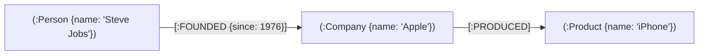

# AI

!!! note "AI Agent 层级"

    第一层：会不会用LLM
    - Prompt
    - Structed Output
    - Tool Calling
    - 基本模型能力

    第二层：能不能给 LLM 正确的信息
    - RAG
    - Chunk
    - Embedding
    - Retrieval
    - Rerank
    - Context Management

    第三层：能否控制 LLM 的行为
    - Workflow
    - LangGraph
    - State Machine
    - Multi-Agent
    - Routing
    - Planning
    - Tool Selection

    第四层：是否可以把 Agent 接入到真实的世界
    - MCP
    - API
    - Database
    - Kafka
    - Python
    - Browser
    - Internal Service

    第五层：Agent 犯错如何处理
    - Guardrail
    - Permission
    - Sandbox
    - Human-in-the-loop
    - Retry
    - Fallback
    - Validation
    - Rollback

    第六层：证明 Agent 的价值
    - Evaluation
    - Trace
    - Bad Case
    - A/B Test
    - Latency
    - Cost
    - Success Rate
    - Business Metric

## Tool Call / Function Calling

LLM 擅长语义理解与意图识别，但存在知识时效截止、缺乏确定性计算能力、无法直接操作外部系统等局限。

核心机制：LLM 本身并不直接执行外部代码，而是根据工具定义（Schema）判断调用时机并生成结构化参数（JSON），由宿主程序实际执行工具，再将执行结果（Observation）返回给 LLM 组织最终回答。常见工具如：实时搜索、计算器、数据库查询、业务 API 等。

## Agent 规划模式 

规划模式决定了 Agent 如何把复杂目标拆解为具体行动。常见的主流模式如下：

### 1. ReAct (Reasoning + Acting) - 动态循环规划
- **核心机制**：`Thought → Action → Observation` 闭环循环。LLM 走一步看一步，根据上一步的执行结果（Observation）动态决定下一步是继续调用工具还是给出最终答复。
- **适用场景**：探索性、结果不确定、依赖外部反馈的任务（如查阅多层关联资料、排查报错日志）。
- **工程痛点与解法**：
  - **容易死循环或早退**：仅靠 LLM 自身判断容易陷入重复调用或幻觉提前终止。
  - **工程实践**：通常在外部宿主程序中增加 **最大步数限制（Max Steps）**，或引入**状态机/校验器（Validator）**强制进行状态流转判断。

### 2. Plan-and-Execute - 显式拆解规划
- **核心机制**：两阶段分离。由 Planner 先完整拆解出子任务列表（Step 1...N），再交由 Executor 逐个执行，最后由 Summarizer 汇总。
- **适用场景**：步骤明确的长链路任务（如“编写某主题的行业调研报告并导出为 PDF”）。
- **优缺点**：
  - **优点**：执行成本可控，全局结构清晰，便于展示步骤进度条。
  - **缺点**：前期规划容易跟不上现实变化。若前置步骤失败，容易引起连锁雪崩（通常需配合 **Plan-and-Solve / 动态重规划 Replanner**）。

### 3. Reflection (Self-Refine) - 反馈式自我演进
- **核心机制**：`Action → Evaluation → Reflection → Retry`。Agent 产出初步结果后，由专门的 Evaluator/Critic 检查打分，若不合格则输出修改意见，LLM 据此反思并迭代。
- **适用场景**：有明确评价标准、对准确率要求高的任务（如代码生成、SQL 编写、长文本润色）。
- **优缺点**：大幅提升单次输出质量，但会带来多倍的延迟（Latency）与 Token 成本消耗。

### 4. Tree of Thoughts (ToT) - 搜索式树状规划
- **核心机制**：将思考过程建模为树结构，每一步生成多个潜在候选思路（分支），借助 BFS（广度优先）/ DFS（深度优先）或评分机制评估各分支价值，并支持**回溯（Backtracking）**。
- **适用场景**：需要全局试错与多步博弈的复杂决策（如 24点游戏、数独、策略制定、算法设计）。
- **优缺点**：推理能力上限最高，但调用次数指数级膨胀，通常限于离线高价值场景。

---

### 模式对比与选型指南

| 模式 | 思考时机 | 适应环境变化能力 | Token/延迟成本 | 适用典型场景 |
| :--- | :--- | :--- | :--- | :--- |
| **ReAct** | 边走边想 | ⭐⭐⭐⭐⭐（强，随时调整） | 中等 | 动态排错、多跳信息检索 |
| **Plan-and-Execute** | 想好再走 | ⭐⭐（偏弱，静态为主） | 低 | 结构化流程、标准多步骤任务 |
| **Reflection** | 做完复盘 | ⭐⭐⭐（中等） | 较高 | 代码/文案生成质量调优 |
| **Tree of Thoughts** | 穷举推演 | ⭐⭐⭐⭐（支持回溯） | 极高（成倍翻番） | 复杂逻辑推理、算法解题 |


## RAG

RAG 的完整流程可分为**离线索引**与**在线推理**两个阶段：

**离线索引**：解析、清洗文档 → 分块（Chunking） → 通过 Embedding 模型向量化 → 存入向量数据库。

**在线推理**：
1. **检索 (Retrieval)**：根据用户问题，从向量数据库中检索语义最相关的 top-K 候选文档片段。
2. **增强 (Augmentation)**：将检索到的文档片段与用户问题组合，构建扩展上下文（Context），作为 Prompt 一并送入 LLM。
3. **生成 (Generation)**：LLM 基于扩展上下文进行回答，确保答案的准确性和可追溯性。

### 向量数据库

| 产品 | 特点 | 适用场景 |
| --- | --- | --- |
| FAISS (Meta) | 单机库，非完整数据库；极致性能研究向 | 原型、离线实验、嵌入现有服务 |
| Milvus | 云原生、分布式、可扩展至百亿级 | 大规模生产、需要分区与多副本 |
| Pinecone | 全托管 SaaS，零运维 | 快速上线、无运维团队 |
| Chroma | 轻量、易上手 | 原型、小项目 |
| Weaviate | GraphQL API、内置模块 | 需要图式查询与生态集成 |
| Qdrant | Rust 实现、过滤丰富、性能强 | 自托管生产、复杂过滤 |

ANN（近似最邻近）算法：
- HNSW（分层导航小世界图）：图索引，查询延迟低，内存占用偏高；高召回常用
- IVF（倒排文件）：聚类划分桶，查询只搜索部分桶；需训练，适合大规模
- PQ（乘积量化）：向量压缩，节省内存、加速距离计算；有损，精度略降

### 图数据库与知识图谱

在 RAG 中，纯向量检索仅关注局部语义相似度，难以捕捉实体间的结构化关联——例如"某人创立了某公司"或"某项目依赖某技术"这类显式关系。图数据库通过构建知识图谱（Knowledge Graph），将离散的文档信息组织为结构化的实体-关系网络，从而帮助 Agent 实现**跨文档关联与多跳关系推理**。

#### Neo4j

Neo4j 是目前最主流的原生图数据库，采用 LPG（Labeled Property Graph，标签属性图）模型，其核心由四个基本元素构成：

1. **节点 (Node)**：表示实体或概念（如 `Person`、`Company`、`Project`）。
2. **标签 (Label)**：对节点进行分组分类（类似关系型数据库中"表"的概念，且一个节点可拥有多个标签，如 `(:Person:Founder)`）。
3. **关系 (Relationship)**：连接两个节点的**有向边**，具有明确的方向和类型（如 `-[:FOUNDED]->`、`-[:DEPENDS_ON]->`）。
4. **属性 (Property)**：附加在节点或关系上的键值对（Key-Value），用于存储结构化数据（如节点属性 `{name: "乔布斯", birth: 1955}`，关系属性 `{since: 1976}`）。



##### Cypher 查询语言

Cypher 是 Neo4j 原生的声明式图查询语言，采用直观的 ASCII 艺术箭头语法 `(节点)-[关系]->(节点)` 来描述图模式，使查询逻辑贴近人类对关系的自然表达：

```cypher
// 查询创立了 Apple 公司的所有人姓名
MATCH (p:Person)-[:FOUNDED]->(c:Company {name: 'Apple'})
RETURN p.name;

// 查找两度关系以内的所有上下游（多跳推理）
MATCH (c:Company {name: 'Apple'})-[*1..2]-(related)
RETURN related;
```

### 检索策略

| 检索方式 | 最优场景 | 弱项 |
|----------|----------|------|
| 向量检索 (Vector) | 语义相似，同义词/改写 | 精确词元、多跳推理 |
| BM25 | 精确词元、日期/代码 | 语义理解 |
| 图谱检索 (Graph) | 多跳关系推理 | 模糊语义查询 |
| **RRF 融合** | **覆盖所有场景** | 依赖各路质量 |

```
                   ┌─────────────┐
                   │    Query    │
                   └──────┬──────┘
          ┌───────────────┼───────────────┐
          ▼               ▼               ▼
   向量检索(Vector)   BM25 检索      图谱检索(Graph)
   语义相似度          精确词元匹配    多跳关系遍历
          └───────────────┼───────────────┘
                          ▼
                   RRF 融合排序
                   score = Σ 1/(k + rank)
                          ▼
                   最终排序结果
```

#### RRF（Reciprocal Rank Fusion）

RRF 是一种无参数的排名融合算法，将多路检索器的排名列表合并为一份最终排序，**只依赖排名、不依赖原始分数**，因此无需对不同检索器的分数做归一化。

$$
\text{RRF}(d) = \sum_{r \in R} \frac{1}{k + \text{rank}_r(d)}
$$

- $R$：所有检索器的结果列表集合
- $k$：平滑常数（默认 60），用于抑制头部排名过度主导，使排名靠后的文档也能贡献有效分数
- $\text{rank}_r(d)$：文档 $d$ 在检索器 $r$ 中的排名（从 1 开始）

**核心优势**：
- **无需分数归一化**——向量/BM25/Graph 三路分数尺度不同也能直接合并
- **只关心排名**——对各检索器的打分分布无假设
- **多路投票效应**——被多个检索器同时召回的文档会获得更高的综合分

#### MMR（Maximal Marginal Relevance）

MMR 在保证相关性的同时引入**多样性约束**，防止检索结果中出现大量语义重复的文档片段：

$$
\text{MMR}(d_i) = \lambda \cdot \text{Sim}(q, d_i) - (1-\lambda) \cdot \max_{d_j \in S} \text{Sim}(d_i, d_j)
$$

- $\text{Sim}(q, d_i)$：文档 $d_i$ 与查询 $q$ 的相关性（如余弦相似度）
- $\max_{d_j \in S} \text{Sim}(d_i, d_j)$：文档 $d_i$ 与已选集合 $S$ 中最相似文档的相似度
- $\lambda$：权衡参数（0~1），$\lambda$ 越大越偏向相关性，越小越偏向多样性

**典型用途**：当 top-K 检索结果存在大量近似重复片段时，使用 MMR 重排序可以显著提升上下文覆盖度，让 LLM 获得更全面的参考信息。

#### Cross-Encoder Rerank

Cross-Encoder 是一种精排模型，将 `(query, document)` **拼接为一个序列**送入 Transformer，直接输出相关性得分。相比检索阶段使用的 Bi-Encoder（分别编码 query 和 document 再算相似度），Cross-Encoder 能捕捉更细粒度的交互语义，但计算成本更高。

| 对比 | Bi-Encoder | Cross-Encoder |
|------|-----------|--------------|
| 输入方式 | query 与 doc 分别编码 | query + doc 拼接编码 |
| 速度 | 快（可预计算向量） | 慢（每对都需推理） |
| 精度 | 较高 | **更高**（捕捉交互特征） |
| 典型角色 | 粗排 / 召回 | **精排 / Rerank** |

**工业实践**：先用向量检索 + BM25 粗排召回 top-K 候选（如 50~100 篇），再用 Cross-Encoder 对候选集精排，取 top-N（如 5~10 篇）送入 LLM，在精度与延迟间取得平衡。

综合以上策略，工业级 RAG 系统的典型架构为：**Vector + BM25 + Graph 三路并行召回 → RRF 融合 → MMR 去重 → Cross-Encoder 精排**，逐层筛选出最终送入 LLM 的高质量上下文。

### 评估

RAG 系统的评估需要同时衡量**检索质量**和**生成质量**两个维度。当前主流方案采用 **LLM-as-Judge**——用一个 LLM 对另一个 LLM 的输出进行自动化评分，替代人工标注。

#### 核心指标

**检索质量**（评估检索器是否找到了正确且精准的上下文）：

| 指标 | 含义 | 参考阈值 | 低分原因 | 优化方向 |
|------|------|----------|----------|----------|
| Context Recall | 检索结果是否**覆盖**了回答所需的全部信息 | 0.8–0.9 | top_k 太小；chunk 太大；Embedding 召回差 | 增大 top_k；缩小 chunk_size；更换 Embedding 模型 |
| Context Precision | 检索结果中**有多少是真正相关的**（信噪比） | 0.7–0.85 | 召回了大量无关片段 | 增加 Rerank；提高相似度阈值；改善文档质量 |

>  Precision 与 Recall 是此消彼长的关系

**生成质量**（评估 LLM 是否基于上下文给出了准确且切题的回答）：

| 指标 | 含义 | 参考阈值 | 低分原因 | 优化方向 |
|------|------|----------|----------|----------|
| Faithfulness | 答案是否**忠实于**检索到的上下文（无幻觉） | 0.85–0.95 | System Prompt 约束弱；检索内容不足 | 强化 System Prompt 约束；优先提升 Recall |
| Answer Relevancy | 答案是否**切题**回答了用户问题 | 0.8–0.9 | Prompt 未引导直接回答；答案冗长绕弯 | Query 重写；优化 Response Prompt |

> **调优优先级**：Recall → Faithfulness → Precision → Relevancy
> 检索召回是一切的基础——如果相关文档根本没被检索到，后续的精排和生成都无法挽救。

!!! note "MRR（Mean Reciprocal Rank）"

    MRR 衡量的是**第一个正确结果出现的排名位置**，是检索系统常用的评估指标：

    $$\text{MRR} = \frac{1}{|Q|}\sum_{i=1}^{|Q|}\frac{1}{\text{rank}_i}$$

    其中 $\text{rank}_i$ 是第 $i$ 个查询中**首个正确结果的排名**。例如三次查询的首个正确结果分别排在第 1、3、2 位，则 $\text{MRR} = \frac{1}{3}(\frac{1}{1} + \frac{1}{3} + \frac{1}{2}) \approx 0.611$。

    MRR 只关心**第一个**命中的位置，适用于"用户只看第一条结果"的场景（如问答、实体查找）。若需评估整体排序质量，应结合 Precision/Recall 使用。

#### 评估框架：Ragas & DeepEval

| 对比 | Ragas | DeepEval |
|------|-------|---------|
| 定位 | 专注 RAG 评估的轻量框架 | 通用 LLM 评估平台（覆盖 RAG + Agent + 对话） |
| 指标 | Faithfulness、Answer Relevancy、Context Precision/Recall | 同名指标 + Hallucination、Toxicity、Bias 等 |
| LLM-as-Judge | 默认 OpenAI，可切换任意 LLM | 同上，支持自定义评估模型 |
| 集成 | LangChain、LlamaIndex | LangChain、LlamaIndex、Pytest（`deepeval test run`） |
| 可视化 | 需搭配外部工具 | 内置 Confident AI 云端仪表盘 |
| 适用场景 | 快速验证 RAG Pipeline | CI/CD 集成、回归测试、多维度综合评估 |

> DeepEval 额外支持 `HallucinationMetric` 幻觉检测

#### 生产可观测性：Langfuse

Langfuse 是开源的 LLM 可观测性平台，专注于**生产环境的追踪与监控**，与 Ragas/DeepEval 的离线评估形成互补：

| 能力 | 说明 |
|------|------|
| **Tracing** | 端到端追踪每次 LLM 调用链路（检索 → 增强 → 生成），记录输入/输出、耗时、Token 消耗 |
| **成本监控** | 按模型、用户、会话维度统计 Token 用量与费用 |
| **在线评估** | 支持接入 LLM-as-Judge 对生产流量实时打分（Faithfulness、Relevancy 等） |
| **Prompt 管理** | 版本化管理 Prompt 模板，支持 A/B 测试与回滚 |
| **数据集管理** | 从生产 Trace 中提取 case 构建评测数据集，反哺离线评估 |

**与 Ragas/DeepEval 的协作模式**：

```
开发阶段                          生产阶段
┌──────────────────┐            ┌──────────────────┐
│  Ragas/DeepEval  │            │     Langfuse     │
│  离线跑评测集      │            │  追踪生产流量      │
│  验证指标达标      │───上线──→   │  在线评估打分      │
│                  │            │  发现 bad case    │
└──────────────────┘            └────────┬─────────┘
        ▲                                │
        └────── 提取 case 反哺评测集 ──────┘
```

> **一句话总结**：Ragas/DeepEval 管"上线前够不够好"，Langfuse 管"上线后跑得怎么样"，两者结合形成评估闭环。

## LangGraph

### 核心概念

|概念|含义|代码实现|
|---|---|
|State|工作流中的数据状态|Dict["str", Any]|
|Node|可复用的节点|Runnable（Prompt，Model，Chain，Custom Runnable 等）|
|Edge|节点之间的连接|ConditionalEdge、SimpleEdge、DirectEdge 等|
|Graph|由节点和边组成的有向无环图（DAG）|Graph|

### 控制流

### 中断

human in the loop


### 护栏

#### PII 
脱敏身份证号、手机号、邮箱、信用卡号等敏感信息

处理策略
| 策略 | 行为 | 是否保留可辨识性 | 典型场景 |
|---|---|---|---|
| redact | 整段替换为 `[REDACTED_类型]` | 否 | 合规、日志脱敏 |
| mask | 部分遮盖，保留少量尾部可读信息 | 否 | 客服界面、人工核对 |
| hash | 替换为确定性哈希 `<类型_hash:摘要>` | 是（假名化，可关联同一值） | 分析、排错 |
| block | 检测到即抛出 `PIIDetectionError` | N/A | 严禁出现该类信息 |

拦截Prompt注入
有害内容过滤 涉及恐怖暴力等
Human in the Loop
Before Agent 输入过滤
After Agent 输出安全

可以有基于规则和LLM语义分析的两种护栏模式，前者更快、更便宜，但容易被绕过，后者更全面，但更贵、更慢

## Hermes

## 记忆

策略：

- 短期记忆（滑动窗口）：根据token或消息条数，保留最近N条消息
- 上下文压缩：触发阈值压缩上下文以节省token
- 长期记忆（向量库）：向量库存储，语义检索召回

记忆打分

| 因子 | 含义 | 来源 |
|---|---|---|
| 相关性 Relevance | 与当前查询的语义相似度 | 向量检索 raw score |
| 近期性 Recency | 越久未访问得分越低 | `exp(-decay_per_hour × hours)` |
| 重要性 Importance | 写入时标注的长期权重 | 0~1，无需再归一化 |

现在通过keywords+BM25可以实现比RAG更好的记忆搜索效果，优点在于精确性和高性能，但对语义理解较差。所以对于编程类系统，BM25和正则可以解决90%以上的问题，而对话类系统则需要结合BM25+ANN

冷热分离的记忆

观测记忆分层压缩：关键信息沉淀，低价值信息遗忘


| 策略 | 做法 | 适合 |
|------|------|------|
| **Last-Write-Wins** | 同 key 直接用新值覆盖旧值 | 偏好、当前目标、当前阻塞点（默认首选） |
| **版本化 + 失效标记** | 不物理删；旧记录 `status=stale` / `superseded_by=新 id`；检索只取 active | 要审计、要回放“为什么改过” |
| **Merge 合并** | 同主题互补、非互斥 → 合成一条（如约束列表） | 多条可并存的偏好/禁止项 |
| **冲突升级** | 两边都像真又互斥 → 问用户，或交给 Reflector 按更新时间/置信度裁决 | 高风险事实（权限、账号、业务规则） |
| **时间窗 / TTL** | 临时状态设过期，到期自动 Forget | “这周在赶 auth”类短期事实，避免抢长期偏好的召回 |


### mem0

## Harness


## MCP


## Cache 命中
降低token成本：
- 模型路由
- 提高cache命中率：
    - 命中类似于MySQL联合索引的最左原则，
    - 静态内容放在前边，动态内容放在后边
    - 通过心跳保持Cache不会被淘汰，否则会重新计算token

## Gateway

业界常用Portkey AI Gateway，可提供统一路由、虚拟key预算、fallback和跨供应商成本跟踪等。

agent任务是分钟级而非毫秒级，因此应该用Temporal等工具支持状态的持久化、重试、任务队列与定时器等功能
